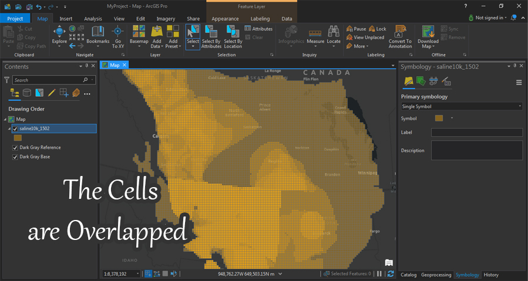

# Calculation Canadian CO2 capacity estimate
I have a shapefile named saline10k_1502 that contains a low, medium, and high calculated estimate CO2 storage potential in saline aquifers in North America, I am only interested in the Canadian CO2 storage, I will create a shapefile containing the total CO2 capacity estimate for a given cell, Because the aquifers are stacked there are aquifers that overlap each other and I am looking for the sum of all the saline aquifer CO2 capacity estimates in each cell.



```py
import os
import shutil
import geopandas as gpd
```

### reading "saline10k_1502.shp"

```py
data = gpd.read_file(r'..\saline10k_1502\saline10k_1502.shp')
data.head(3)
```
|    | COL_ROW   | PARTNERSHI   | ARRA_PROJE   | RESOURCE_N     | BASIN_NAME   |   RSC_AREA_C |   VOL_LOW |   VOL_MED |   VOL_HIGH |   DEPTH_FT |   THICKNESS_ |   SALINITY_T |   PRESSURE_P |   TEMPERATUR |   POROSITY_P |   PERMEABILI |   ASSESSED | CYCLE_OF_L   |   OVERLAP |   DUPLICATE |   MED_CALCED |   Shape_Leng |   Shape_Area |
|---:|:----------|:-------------|:-------------|:---------------|:-------------|-------------:|----------:|----------:|-----------:|-----------:|-------------:|-------------:|-------------:|-------------:|-------------:|-------------:|-----------:|:-------------|----------:|------------:|-------------:|-------------:|-------------:|
|  0 | 314 - 367 | PCOR         |              | Basal Cambrian |              |      1.1e+07 |         0 |         0 |          0 |          0 |            0 |       202396 |         4877 |          290 |    0.037079  |      34      |          1 | Atlas V, v1  |         1 |           0 |            0 |        40000 |        1e+08 |
|  1 | 314 - 366 | PCOR         |              | Basal Cambrian |              |      8.3e+07 |         0 |         0 |          0 |          0 |            0 |       201717 |         4392 |          294 |    0.0355396 |      15.6667 |          1 | Atlas V, v1  |         1 |           0 |            0 |        40000 |        1e+08 |
|  2 | 314 - 365 | PCOR         |              | Basal Cambrian |              |      9.3e+07 |         0 |         0 |          0 |          0 |            0 |       200875 |         3795 |          299 |    0.0353897 |      16.9333 |          1 | Atlas V, v1  |         1 |           0 |            0 |        40000 |        1e+08 |
#
### calculate Canadian CO2 capacity estimate

The Canadian saline aquifers will under attribute Partnership – PCOR and the seven saline aquifers of RESOURCE_N attribute Basal Cambrian, Beaverhill Lake Group, Elk Point Group, Rundle Group, Viking, Winterburn Group, and Woodbend Group.

```py
canadian_data = data.loc[(data['RESOURCE_N']=='Basal Cambrian')|(data['RESOURCE_N']=='Beaverhill Lake Group')|(data['RESOURCE_N']=='Elk Point Group')|(data['RESOURCE_N']=='Rundle Group')|(data['RESOURCE_N']=='Viking')|(data['RESOURCE_N']=='Winterburn Group')|(data['RESOURCE_N']=='Woodbend Group')|(data['PARTNERSHI']=='PCOR')]
```

Create a Shapefile and CSV containing lat longs of total Canadian CO2 capacity estimate I will calculate it by Summation of VOL_LOW, VOL_MED, VOL_HIGH, and RSC_AREA_C for each Cell or the Cells that overlap in the same location.

```py
co2 = canadian_data[['VOL_LOW','VOL_MED','VOL_HIGH','RSC_AREA_C','geometry','RESOURCE_N']]
```
Here is I will create a "spatial_id" column to create an ID to cells so the cells overlapped will have one ID (or spatial ID 😉), Then I will implement aggregation with dissolve based on my spatial ID.

```py
co2['spatial_id'] = list(zip(co2['geometry'].centroid.x , co2['geometry'].centroid.y))
sum_co2 = co2.dissolve(by="spatial_id",aggfunc='sum')
sum_co2.head(3)
```
| spatial_id                        | geometry                                                                                                                           |     VOL_LOW |     VOL_MED |    VOL_HIGH |   RSC_AREA_C |
|:----------------------------------|:-----------------------------------------------------------------------------------------------------------------------------------|------------:|------------:|------------:|-------------:|
| (-1336251.7400000002, 1363935.68) | POLYGON ((-1341251.74 1358935.68, -1341251.74 1368935.68, -1331251.74 1368935.68, -1331251.74 1358935.68, -1341251.74 1358935.68)) | 0           | 0           | 0           |  1.85008e+06 |
| (-1326251.7400000002, 1333935.68) | POLYGON ((-1331251.74 1328935.68, -1331251.74 1338935.68, -1321251.74 1338935.68, -1321251.74 1328935.68, -1331251.74 1328935.68)) | 3.19865e+06 | 6.05149e+06 | 1.0374e+07  |  1.79924e+07 |
| (-1326251.7400000002, 1343935.68) | POLYGON ((-1331251.74 1338935.68, -1331251.74 1348935.68, -1321251.74 1348935.68, -1321251.74 1338935.68, -1331251.74 1338935.68)) | 8.07035e+06 | 1.52682e+07 | 2.61741e+07 |  5.54231e+07 |

re-indexing & delete spatial _id 

```py
sum_co2.reset_index(inplace=True)
sum_co2.drop(columns=['spatial_id'],inplace=True)
sum_co2.head(3)
```
goodbye spatial _id 👋

|    | geometry                                                                                                                           |     VOL_LOW |     VOL_MED |    VOL_HIGH |   RSC_AREA_C |
|---:|:-----------------------------------------------------------------------------------------------------------------------------------|------------:|------------:|------------:|-------------:|
|  0 | POLYGON ((-1341251.74 1358935.68, -1341251.74 1368935.68, -1331251.74 1368935.68, -1331251.74 1358935.68, -1341251.74 1358935.68)) | 0           | 0           | 0           |  1.85008e+06 |
|  1 | POLYGON ((-1331251.74 1328935.68, -1331251.74 1338935.68, -1321251.74 1338935.68, -1321251.74 1328935.68, -1331251.74 1328935.68)) | 3.19865e+06 | 6.05149e+06 | 1.0374e+07  |  1.79924e+07 |
|  2 | POLYGON ((-1331251.74 1338935.68, -1331251.74 1348935.68, -1321251.74 1348935.68, -1321251.74 1338935.68, -1331251.74 1338935.68)) | 8.07035e+06 | 1.52682e+07 | 2.61741e+07 |  5.54231e+07 |

create latitude and longitude columns

```py
sum_co2['lat'] = sum_co2.to_crs(4326)['geometry'].centroid.y
sum_co2['lon'] = sum_co2.to_crs(4326)['geometry'].centroid.x
sum_co2.head(3)
```

|    | geometry                                                                                                                           |     VOL_LOW |     VOL_MED |    VOL_HIGH |   RSC_AREA_C |     lat |      lon |
|---:|:-----------------------------------------------------------------------------------------------------------------------------------|------------:|------------:|------------:|-------------:|--------:|---------:|
|  0 | POLYGON ((-1341251.74 1358935.68, -1341251.74 1368935.68, -1331251.74 1368935.68, -1331251.74 1358935.68, -1341251.74 1358935.68)) | 0           | 0           | 0           |  1.85008e+06 | 55.5994 | -121.452 |
|  1 | POLYGON ((-1331251.74 1328935.68, -1331251.74 1338935.68, -1321251.74 1338935.68, -1321251.74 1328935.68, -1331251.74 1328935.68)) | 3.19865e+06 | 6.05149e+06 | 1.0374e+07  |  1.79924e+07 | 55.3663 | -121.16  |
|  2 | POLYGON ((-1331251.74 1338935.68, -1331251.74 1348935.68, -1321251.74 1348935.68, -1321251.74 1338935.68, -1331251.74 1338935.68)) | 8.07035e+06 | 1.52682e+07 | 2.61741e+07 |  5.54231e+07 | 55.4522 | -121.206 |

creating a folder with name 'sum_co2' to contain CO2 capacity estimate files

```py
if os.path.isdir('sum_co2'):
    shutil.rmtree('sum_co2',ignore_errors=True)
os.mkdir('sum_co2')
sum_co2.to_file(r"sum_co2/sum_co2.shp")
sum_co2.to_file(r"sum_co2/sum_co2.csv",driver='CSV')
```
#
### create Shapefiles and csv to each Canadian saline aquifers

Create Shapefiles and CSV containing lat longs of each of the seven Canadian saline aquifers (Seven shapefiles, seven CSV) with Keep all existing attribute values.

```py
saline_aquifers = data.loc[(data['RESOURCE_N']=='Basal Cambrian')|(data['RESOURCE_N']=='Beaverhill Lake Group')|(data['RESOURCE_N']=='Elk Point Group')|(data['RESOURCE_N']=='Rundle Group')|(data['RESOURCE_N']=='Viking')|(data['RESOURCE_N']=='Winterburn Group')|(data['RESOURCE_N']=='Woodbend Group')]
```

creating a folder with name 'saline_aquifers' to contain folders are contain saline aquifers files

```py
if os.path.isdir('saline_aquifers'):
    shutil.rmtree('saline_aquifers',ignore_errors=True)
os.mkdir('saline_aquifers')
```
creating files to each saline aquifers files

```py
for inx,data in saline_aquifers.groupby('RESOURCE_N'):
    data['lat'] = data.to_crs(4326)['geometry'].centroid.y
    data['lon'] = data.to_crs(4326)['geometry'].centroid.x
    os.mkdir(os.path.join('saline_aquifers',str(inx)))
    data.to_file(os.path.join('saline_aquifers',str(inx),str(inx+'.shp')))
    data.to_file(os.path.join('saline_aquifers',str(inx),str(inx+'.csv')),driver='CSV')
```
